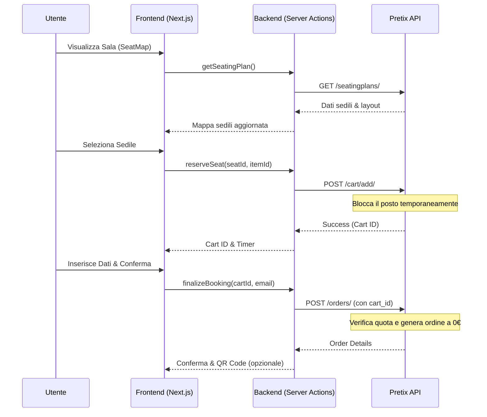

# VESTRICINEMASHOP - Architettura e Flussi di Comunicazione

## 1. Architettura del Sistema

Il sistema è basato su **Next.js 16** con **App Router**. La logica di business è gestita tramite **Server Actions** per garantire la sicurezza del token API di Pretix.

### Cartelle Principali
- `src/app/`: Contiene le rotte dell'applicazione (Home, Dettaglio Film, Admin).
- `src/components/`: Componenti UI riutilizzabili (SeatMap, BookingFlow, Checkout).
- `src/services/`: Client per le API esterne (Pretix, TMDB).
- `public/`: Asset statici.

## 2. Flusso di Prenotazione (Happy Path)

## 3. Sicurezza e Integrazione Pretix

- **API Token**: Gestito esclusivamente lato server tramite variabili d'ambiente (`PRETIX_TOKEN`).
- **Zero-Amount Orders**: La logica di checkout forza il prezzo a `0.00` e utilizza un metodo di pagamento "manuale" o configurato come "free" su Pretix.
- **Seat Scaling**: L'utilizzo delle API native di Pretix per il carrello garantisce che i posti siano bloccati durante la compilazione dei dati, evitando overbooking.

## 4. Test di Integrazione

I test verranno eseguiti utilizzando il browser di Antigravity per simulare l'intero flusso dall'interfaccia utente, verificando:
1. Caricamento corretto della mappa sedili.
2. Effettiva aggiunta al carrello su Pretix.
3. Creazione dell'ordine a importo zero.
